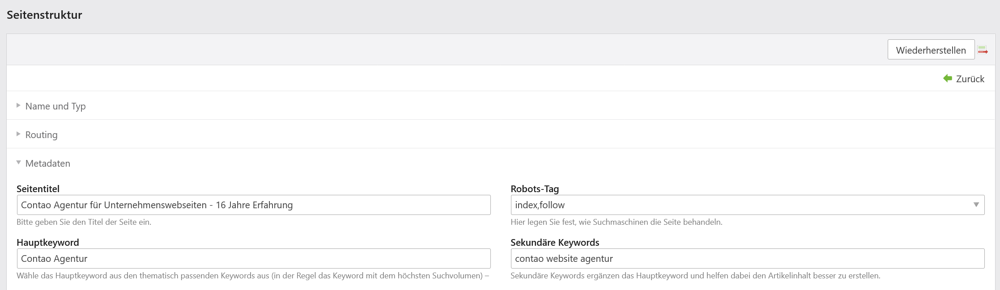
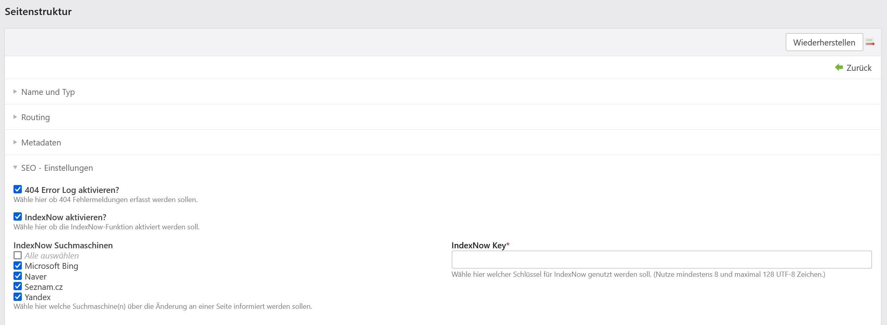
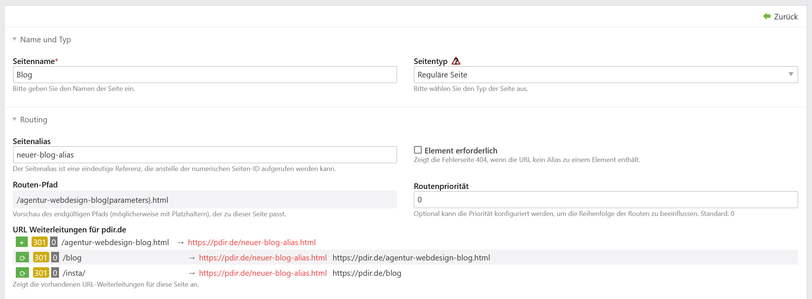
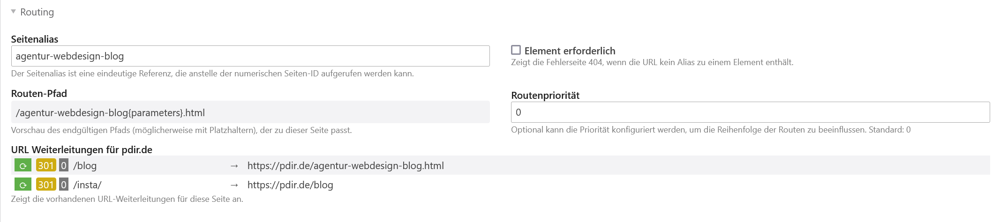
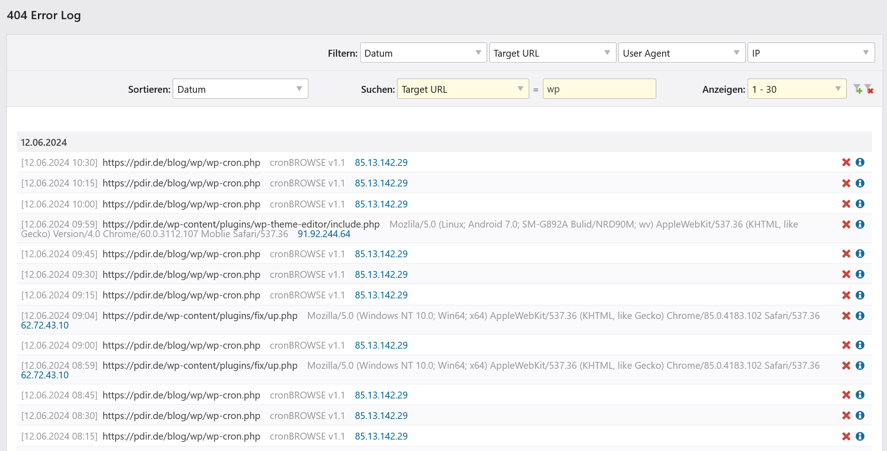

# pdir/contao-seo-plugin

We help website owners and editorial teams to get more traffic from search engines like Google. The Contao SEO Plugin
helps users to optimize their content and make it easy to find for both users and search engines. With the Contao SEO
plugin, you have the most important on-page factors directly in view.

### Current range of functions of version 1.0.0
- SEO analysis of 8 typical on-page problems
- IndexNow function for all known providers [indexnow.org](https://www.indexnow.org/faq)
- Possibility to activate a 404 error log
- Monitoring of alias changes (experimental, must be activated in user profile)
- Display existing URL redirects in the alias view

### An outlook on further functions
- At least 30 additional tests for on-page recommendations
- Measure and track keyword rankings
- Google Search Console integration
- Monitor 404 errors and export as CSV
- Forwarding of renamed pages
- Import redirects via CSV
- Position history for keywords, pages and posts
- Automate missing captions
- Insert links to explanations for each test

**Acknowledgments**
The first version of this extension was created as part of a two-week student internship, thanks Markus.
Thanks also to [terminal42](https://github.com/terminal42/) for the [URL Rewrite Bundle](https://github.com/terminal42/contao-url-rewrite).

**Screenshots**

SEO toolbar

Keyword settings

IndexNow settings

Monitoring of alias changes

Display existing URL redirects in the alias view

404 error log

## German

Wir helfen Website-Betreibern und Redaktionsteams, mehr Traffic von Suchmaschinen wie Google zu erhalten. Das Contao SEO
Plugin hilft Nutzern, ihre Inhalte gut zu optimieren und sowohl für Nutzer als auch für Suchmaschinen leicht zu finden.
Mit dem Contao SEO Plugin hast du die wichtigsten OnPage Faktoren direkt im Blick.

### Aktueller Funktionsumfang der Version 1.0.0
- SEO Analyse von 8 typischen Onpage Problemen
- IndexNow Funktion für alle bekannten Anbieter [indexnow.org](https://www.indexnow.org/de_de/faq)
- Möglichkeit, ein 404-Fehlerprotokoll zu aktivieren
- Überwachung von Alias-Änderungen (experimentell, muss im Benutzerprofil aktiviert werden)
- Anzeige bestehender URL-Weiterleitungen in der Alias-Ansicht

### Ein Ausblick auf weitere Funktionen
- Mindestens 30 weitere Tests für Onpage Empfehlungen
- Messen und verfolgen von Keyword-Rankings
- Google Search Console Integration
- 404 Fehler überwachen und exportieren als CSV
- Weiterleitung von umbenannten Seiten
- Import von Weiterleitungen per CSV
- Positionsverlauf für Keywords, Seiten und Beiträgen
- Fehlende Bildunterschriften automatisieren
- Links zu Erläuterungen für jeden Test

**Danksagung**
Die erste Version dieser Erweiterung ist im Rahmen eines zweiwöchigen Schülerpraktikums entstanden, Danke Markus.
Danke auch an [terminal42](https://github.com/terminal42/) für das [URL Rewrite Bundle](https://github.com/terminal42/contao-url-rewrite).
